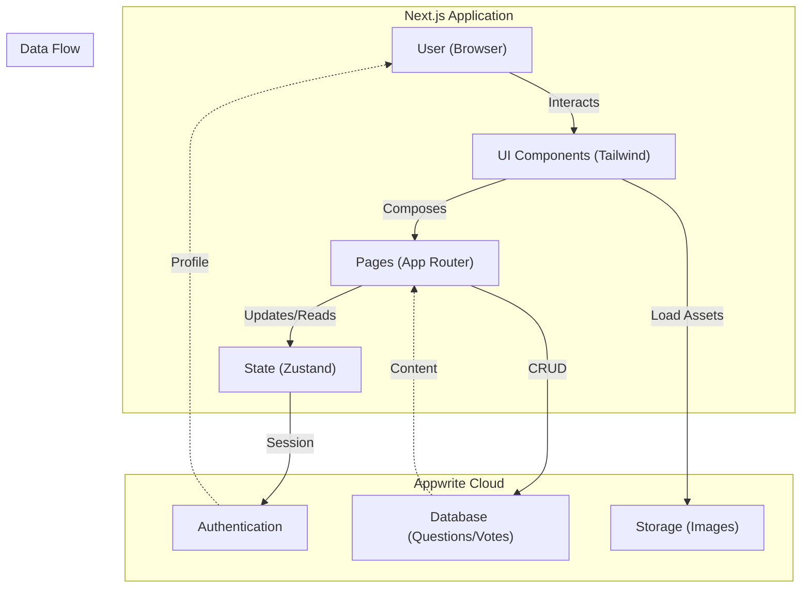

<p align="center">
  
</p>

<h1 align="center">Dev Query - Community Knowledge Platform</h1>

###

<div align="center">
  
  
  
  
  
  
  
  
  
</div>

###

**Dev Query** is a modern, full-stack Q&A platform tailored for developers. It enables users to ask questions, share knowledge, and engage with a community through a reputation-based system. Built with performance and scalability in mind, it leverages **Next.js** for the frontend and **Appwrite** as a secure Backend-as-a-Service (BaaS).

---

## ✨ Features

- 💬 **Q&A System**: Post questions, write answers, and engage in threaded discussions.
- 🗳️ **Voting Mechanism**: Upvote or downvote content to bubble up the best solutions.
- 📝 **Markdown Support**: Robust text editor with syntax highlighting for developer-friendly posts.
- 🏷️ **Tagging System**: Categorize questions for easy discovery and filtering.
- 🎨 **Modern Interface**: Glassmorphism design with premium animated backgrounds and dark mode support.
- 🔍 **Global Search**: Instant, URL-syncing search to find relevant topics quickly.
- 🔐 **Secure Auth**: Robust login and session management powered by Appwrite.
- 📱 **Responsive Design**: Optimized for seamless experience across mobile, tablet, and desktop.

---

## �️ Screenshots

### Dashboard & Feed
| | |
|:---:|:---:|
|  |  |
|  |  |

### Question & Answers
| | |
|:---:|:---:|
|  |  |
|  |  |

### User Profile & Settings
| | |
|:---:|:---:|
|  |  |
|  |  |

### Authentication & Mobile
| | |
|:---:|:---:|
|  |  |

---

## �️ Tech Stack

**Frontend:**
- Next.js 16 (App Router)
- React 19
- TypeScript
- Tailwind CSS
- Untitled UI (Design System)

**Backend:**
- Appwrite (Auth, Database, Storage)

**State Management:**
- Zustand

---

## 🧑‍💻 Target Users

- 💻 **Developers**: From beginners to experts looking to solve bugs and share knowledge.
- 🎓 **Students**: Learning to code and needing help with assignments or concepts.
- 🤝 **Open Source Contributors**: discussin implementation details and best practices.
- 🌐 **Tech Enthusiasts**: Keeping up with the latest trends and technologies.

---

## 🏗️ Architecture



---

## 🚀 Getting Started

1.  **Clone the repository**
    ```bash
    git clone https://github.com/yourusername/qna-system.git
    cd qna-system
    ```

2.  **Install Dependencies**
    ```bash
    npm install
    ```

3.  **Environment Setup**
    Create a `.env.local` file with your Appwrite credentials:
    ```env
    NEXT_PUBLIC_APPWRITE_ENDPOINT=https://cloud.appwrite.io/v1
    NEXT_PUBLIC_APPWRITE_PROJECT_ID=your_project_id
    NEXT_PUBLIC_APPWRITE_DATABASE_ID=your_database_id
    ```

4.  **Run Development Server**
    ```bash
    npm run dev
    ```

Open [http://localhost:3000](http://localhost:3000) to see the app.
