# Dev Query

**Dev Query** is a modern, full-stack Q&A platform tailored for developers. It enables users to ask questions, share knowledge, and engage with a community through a reputation-based system.

Built with performance and scalability in mind, it leverages **Next.js 14** for the frontend and **Appwrite** as a secure Backend-as-a-Service (BaaS).

---

## 🛠️ Tech Stack

**Core Framework**
*    **Next.js 16** (App Router)
*    **React 19**
*    **TypeScript**

**Styling & UI**
*    **Tailwind CSS**
*   **Aceternity UI** (Animated components like Background Beams, Spotlight)
*   **Lucide React** (Icons)
*   **Radix UI** (Accessible primitives)

**Backend & State**
*    **Appwrite** (Auth, Database, Storage)
*   **Zustand** (Global State Management)

**Editor**
*   **@uiw/react-md-editor** (Markdown support)

---

## 🏗️ Architecture

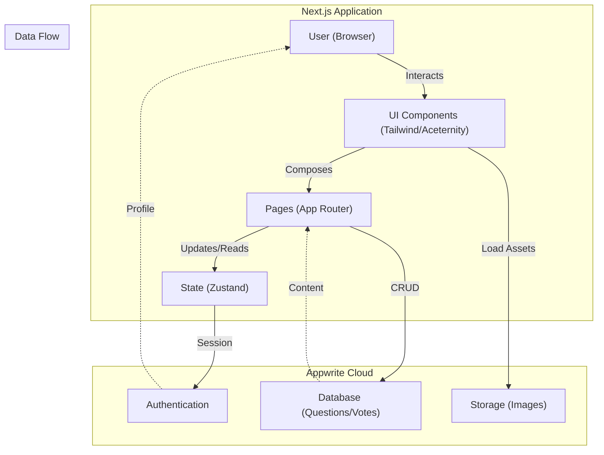

---

## 📸 Screenshots

### Dashboard & Feed
| | |
|:---:|:---:|
| 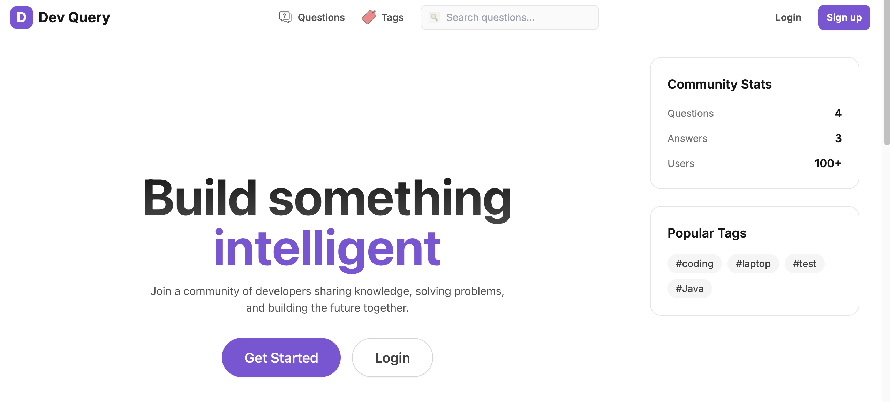 | 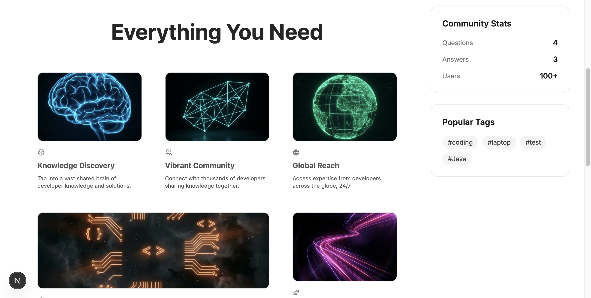 |
| 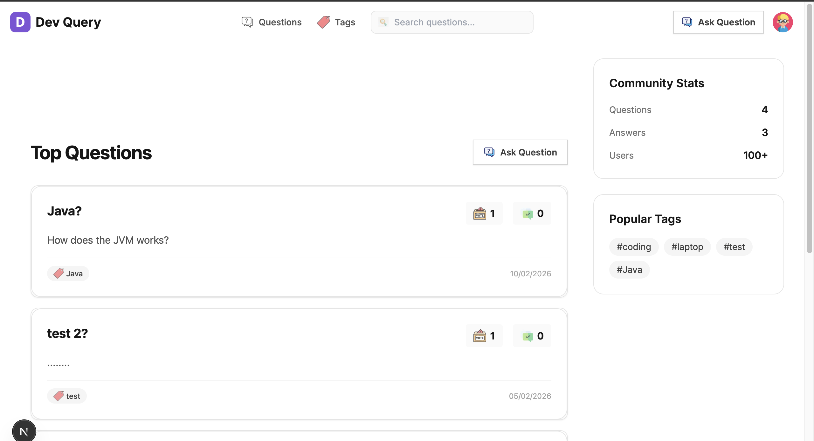 |  |

### Question & Answers
| | |
|:---:|:---:|
| 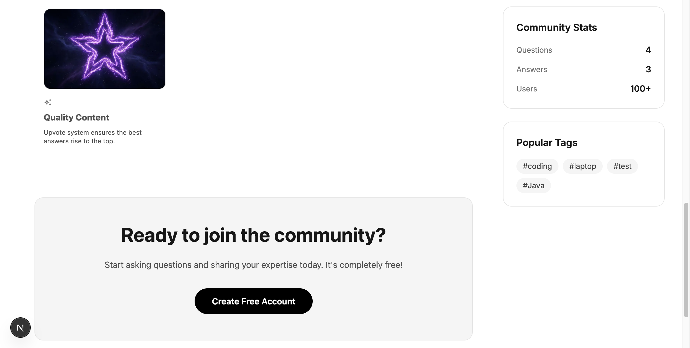 | 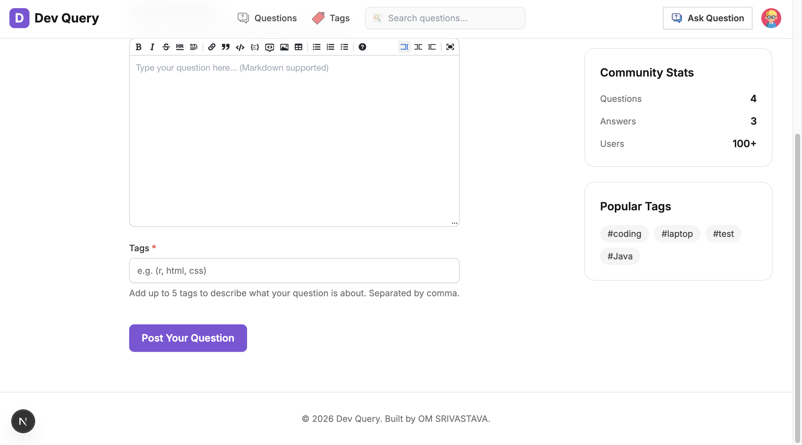 |
| 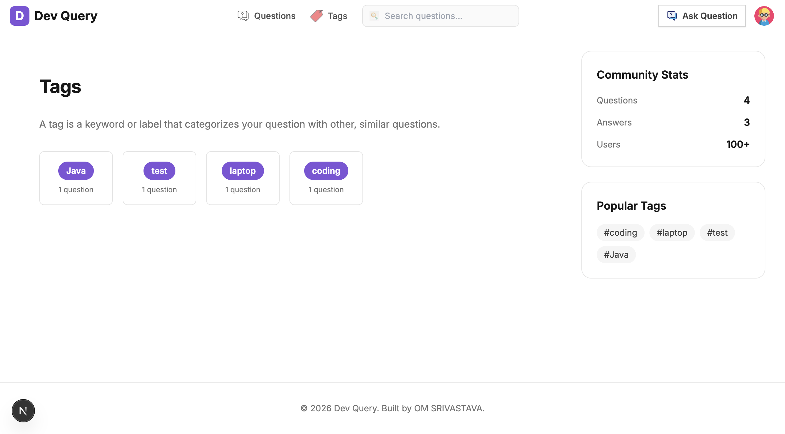 | 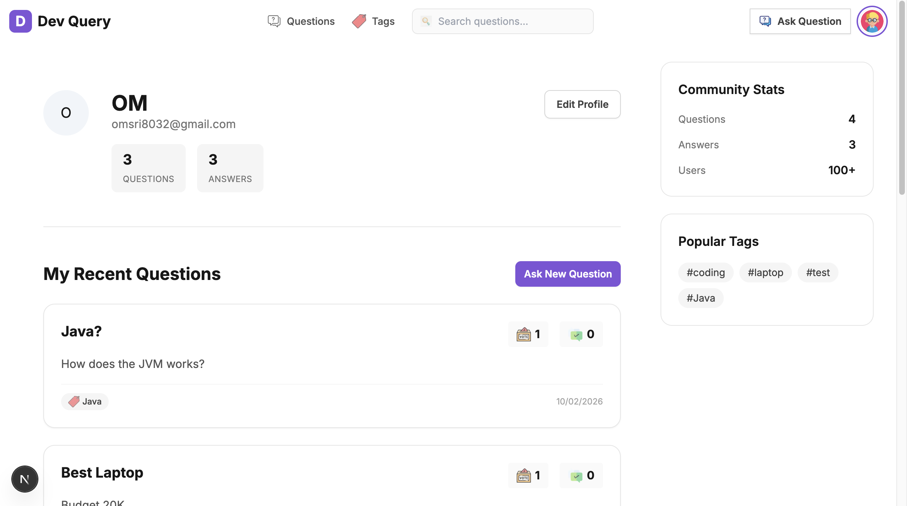 |

### User Profile & Settings
| | |
|:---:|:---:|
| 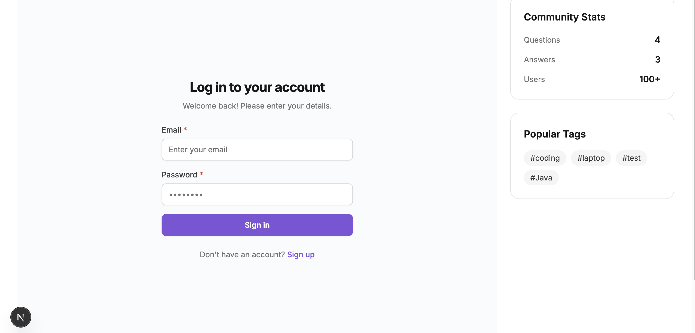 | 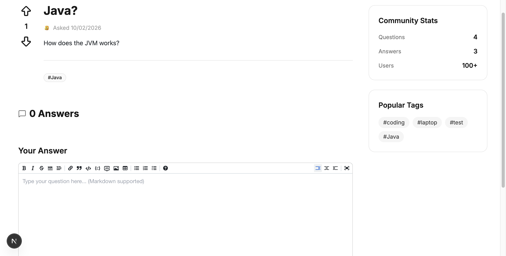 |
| 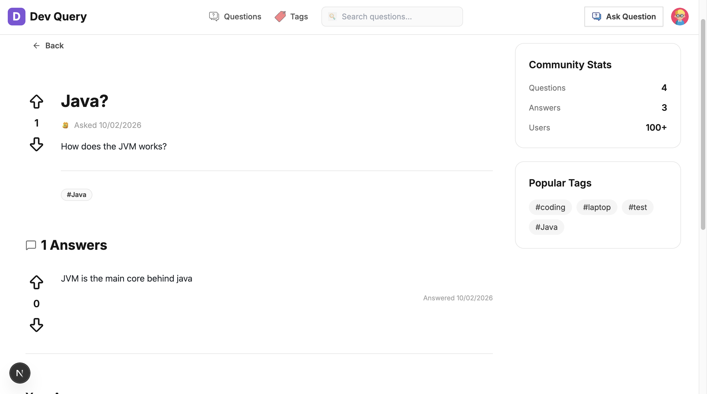 |  |

### Authentication & Mobile
| | |
|:---:|:---:|
| 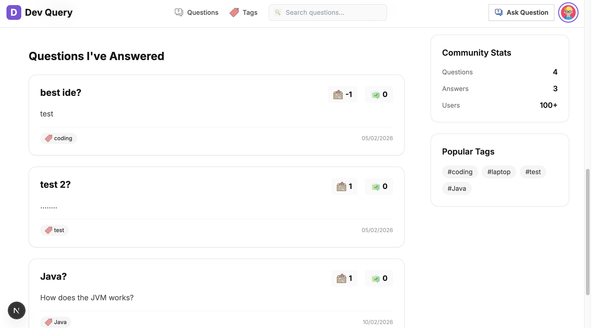 | 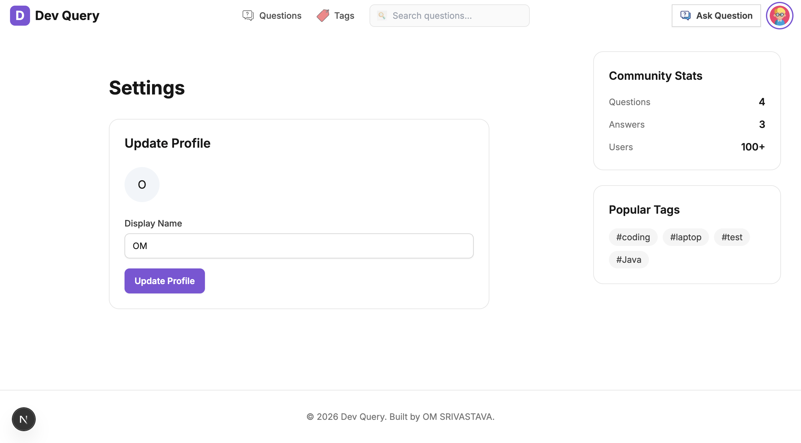 |

---

## ✨ Key Features

1.  **Authentication**: Secure Email/Password login flows via Appwrite.
2.  **Real-time Q&A**: Post questions and answers instantly.
3.  **Rich Text Editing**: Full Markdown support for code snippets and formatting.
4.  **Reputation System**: Upvote/Downvote to surface the best community content.
5.  **Smart Search**: URL-based search filtering for easy sharing.
6.  **Modern Design**: Dark mode support, animated backgrounds, and responsive layouts.

---

## 🚀 Getting Started

1.  **Clone the repository**
    ```bash
    git clone https://github.com/yourusername/qna-system.git
    cd qna-system
    ```

2.  **Install Dependencies**
    ```bash
    npm install
    ```

3.  **Environment Setup**
    Create a `.env.local` file with your Appwrite credentials:
    ```env
    NEXT_PUBLIC_APPWRITE_ENDPOINT=https://cloud.appwrite.io/v1
    NEXT_PUBLIC_APPWRITE_PROJECT_ID=your_project_id
    NEXT_PUBLIC_APPWRITE_DATABASE_ID=your_database_id
    ```

4.  **Run Development Server**
    ```bash
    npm run dev
    ```

Open [http://localhost:3000](http://localhost:3000) to see the app.
